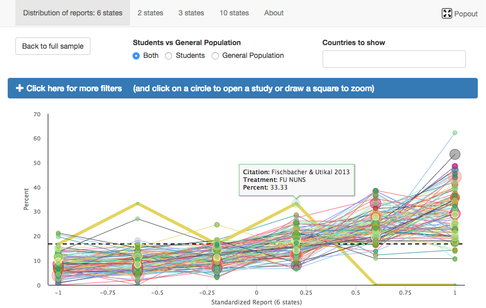

# Preferences for Truth Telling

This is a collection of Shiny apps designed and developed to accompany the www.preferencesfortruthtelling.com website, which provides an interactive exploration of the meta-analysis of other 420 experiments using [Fischbacher and Föllmi-Heusi's truth-telling experiment](doi.org/10.1111/jeea.12014).

The academic contact for this work is is (Dr. Johannes Abeler)[http://orcid.org/0000-0002-0789-177X]. Below is screenshot of the iframe2 Shiny app.

</img>

This code has been deposited on Figshare: http://doi.org/10.6084/m9.figshare.5539942